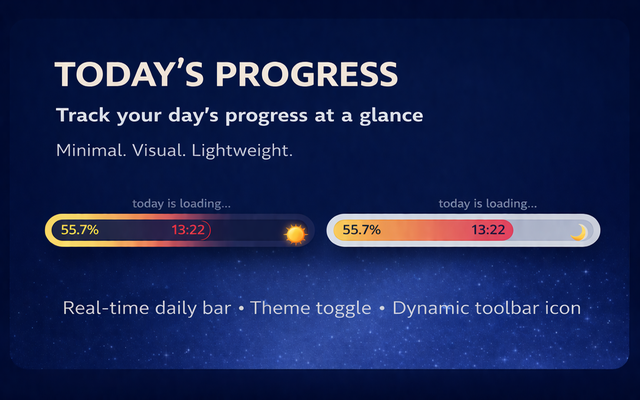
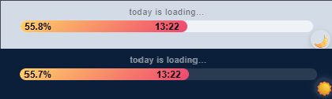
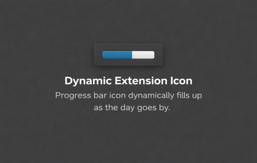

<h1 align="center"> Day Progress Chrome Extesion</h1>

<div align="center">

  <a href="https://developer.chrome.com/docs/extensions/develop/migrate/what-is-mv3" style="text-decoration: none;">
    
  </a>
  
  <a href="./LICENSE">
    
  </a>

<h2>Today’s Progress</h2>

<p>
A minimal browser extension that shows how much of your day has passed in real time.
</p>

<p>
Clean. Lightweight. Focused.
</p>

<a href="https://chromewebstore.google.com/detail/todays-progress/knmhogkimljcnalecahidlaalianmgep">
  
</a>

</div>

## 📸 Preview

<!-- <p align="center">
  
</p> -->

 

## ✨ Features

* Live daily progress bar
* Clean and minimal UI
* Dark & light mode toggle
* Lightweight and fast
* Works fully locally on your device

## 🚀 How it works

The extension calculates how much of the current day has passed using your system time and displays it as a visual progress bar.

<p >
  
</p>

<p >
  
</p>


## 🔒 Privacy

**Today’s Progress does not collect, store, or share any personal data.**

The extension only uses the current system time to calculate and display the daily progress bar.

All processing happens locally on the user’s device.

For more details, see the [Privacy Policy](https://gist.githubusercontent.com/Ayseorkan/12908a622d05d1a4914532b438da3e1b/raw/37654af285f347484fa16e3c17d67e9f48aea879/privacy-policy.txt).

<!-- 👉 [Privacy Policy](./privacy-policy.md)     --> 

## 📦 Installation (Manual)
#### Load unpacked in Chrome
1. Clone this repo
2. Go to `chrome://extensions/`
3. Enable **Developer Mode**
4. Click **Load unpacked**
5. Select the project folder

## Project Structure

```bash
assets/
  icons/
    icon-16.png
    icon-32.png
    icon-48.png
    icon-128.png
    promo.png
    ss.png
    toolbar.png

src/
  background.js
  index.html
  popup.js
  style.css

LICENSE
README.md
manifest.json
privacy-policy.md
```

## 🛠 Tech

* Vanilla JavaScript
* Chrome Extension (Manifest v3)
* HTML / CSS

## 💡 Why?

To help you stay aware of your time and improve daily focus — especially useful for people with ADHD or focus challenges.

Made with simplicity in mind.

## 📄 License

This project is licensed under the MIT License.

You are free to use, modify, and distribute this software with proper attribution.

See the [LICENSE](./LICENSE) file for details.

